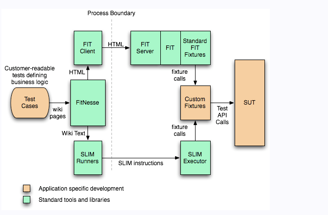

# [Xebium](https://github.com/Elakkiyaab/xebium)

Useful Links
------------
* [Xebium](http://xebia.github.com/Xebium/) combines the powers of FitNesse and Selenium.
* Visit the [xebium home page](http://xebia.github.com/Xebium/) for more details and examples.
* [Sample script and more details](https://github.com/Elakkiyaab?tab=repositories)
## Tool that integrate fitnesse and selenium.

# Prerequisites: #
 Java
 Maven
#           setting up java:                   #
    linux   : http://www.mkyong.com/java/how-to-install-java-jdk-on-ubuntu-linux/
    windows : doownload java from oracle site,  install and JAVA_HOME in the PATH setting.

# Setting up maven: #
    linux   : http://www.mkyong.com/maven/how-to-install-maven-in-ubuntu/
    windows : http://www.mkyong.com/maven/how-to-install-maven-in-windows/

Check if the installation is good run ¨ mvn -v ¨ and you see the installed version of java and maven.

# Useful reference: #
http://butunclebob.com/.FitNesse.UserGuide
http://www.fitnesse.org/FrontPage
http://docs.seleniumhq.org/projects/
https://github.com/xebia/Xebium/blob/master/

# web Driver: #
http://docs.seleniumhq.org/download/ --> check third part drivers.
http://docs.seleniumhq.org/projects/webdriver/
http://www.shooter-smith.co.uk/setting-up-ie-chrome-and-safari-drivers-to-work-with-xebium/
http://phantomjs.org/download.html
https://github.com/SeleniumHQ/selenium/wiki/ChromeDriver

# Chrome Driver #
http://chromedriver.storage.googleapis.com/index.html
Note: 2.20 is current version in the driver folder.

# Setting System property in fitnesse wiki #
http://butunclebob.com/FitNesse.SuiteAcceptanceTests.SuiteWidgetTests.TestVariablesFromSystemProperties

# Selenium grid #

# Maven Plugins: #
* [mafia-maven-plugin](https://github.com/sijpesteijn/mafia-maven-plugin)
* [fitnesse-launcher-maven-plugin](http://fitnesse-launcher-maven-plugin.googlecode.com/svn/maven/site/fitnesse-launcher-maven-plugin/config.html)
* [build-helper-maven-plugin](http://www.mojohaus.org/build-helper-maven-plugin/usage.html)
* [maven-antrun-plugin](https://maven.apache.org/plugins/maven-antrun-plugin/)
 Note: Sample set for the Plugins:

